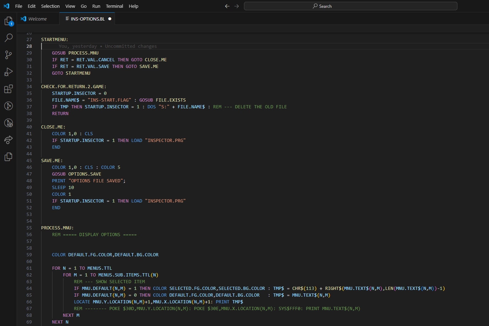

# basload-lang README

This extension adds language support for BASLOAD, a transpiler that outputs Commander X16 BASIC-compatible code.

## Features

- Syntax highlighting.

## Requirements

If you have any requirements or dependencies, add a section describing those and how to install and configure them.

## Extension Settings

None

## Known Issues

None

## Release Notes

### 1.1.1

Add variable and label syntax highlighting now supports the `_` character.

### 1.0.0

Initial release!
